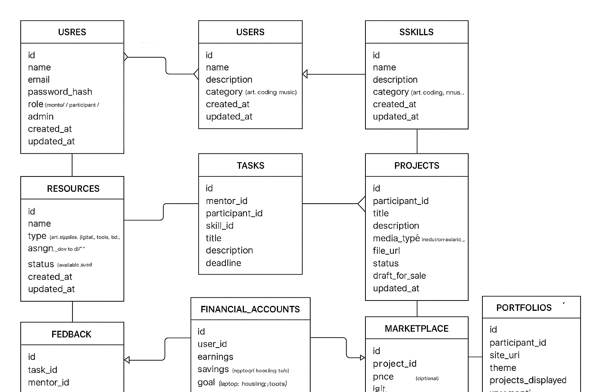

  
# Original Plan

I have a plan. So the plan is to buy a lot of colored pencils from HEB like the ones Chris gave me. They are cheap but good. Then a bunch of notebooks that have paper you can tear out and display for colored pencil drawings. I have started doing a weekly walk to downtown from my apartment which is around 4 miles one way, I go straight down 7th by the ARCH. I can give out the colored pencils and notebook paper. I will tell them my story about how I turned my life around after I lost everything due to a series of armed robberies and home invasions where I used to live and I lost my birth certificate, my identity, all my technology, all my clothes, belongings and anything I could not carry with me. Then I will tell them how all I had left were colored pencils and I would just draw all day out of spite and revenge. Revenge by rebuilding my life out of spite of my enemies who stole my life from me. One of those enemies was me, which I realized on a year of tripping on DXM which helped me get out of the black pill mindset that infects humanity, it is worse than the woke mind virus, which is still better than the unwoke mind virus. I am creating a new mind virus to replace all the others. This one is based on my failings with Chris and how I was able to use what I learned from trying to help him in the past. Now I know about RLHF, reinforcement through human feedback, to train AI. I am using the same concept to train people. Stands to figure training AI would not be that different than training people. Encode/Decode Anyway. My plan is make friends with people on my walks downtown and discover people with artistic talent, that is simply the determination it takes to develop artistic skill, then I am going to gift them the art supplies and return and buy what they make. But I will say something like I only buy in bulk so that they have to work harder and create and practice the same concept multiple times. I can instruct them as well in some art criticism to help them if they want along the way, although that is pretentious and I would rather get their raw voice. Then I will display their art in my apartment and turn my apartment into a private art gallery where I will host people by showing them my art and then show them the homeless people's art as well. Then if they sell a piece of art I will give them the full amount as well as the credit for their work, the information they wish to provide the buyer, such how to contact or help them, etc, and then on my next walk deliver the money to them. I will also keep some of the money and save it up for them. Then once it reaches a threshold I will buy them things which will improve their life the most. Things like a phone or a chromebook or a laptop or the deposit to drive for Uber or an apartment etc. Of course I will inform them of this and I am sure they will agree since they will still be getting the majority of the sales upfront as cash upon sale with whatever percentage they choose going into this savings I would manage for them. I would only manage it until I set them up with a bank account and the other things they need to manage finances. Once they have enough for say, a laptop, then I can take them to the public library and show them how to use the wifi and get them a job on a computer so they can get a large enough income to get out of homelessness. That is basically the path I took and I think that I can help others follow a similar path. But I have to set firm boundaries which I am good at. I am also good at picking people. I can suspect and detect manipulation easily. I don't judge. I am manipulative as is everyone else. You do what you need to survive. What I want to do is to teach how to to have plenty rather than just survive. Once you have plenty you can share and teach others to as well. This will spread and rather than be so entitled and unrealistic perhaps Americans will learn their lesson and start living a more sustainable lifestyle rather than their absurd consumptive wasteful lifestyle. Then I will create a website and help them monetize their artist personality just like all the pretentious fucks do that pay for squarespace to build their shopify store for them. Instead I will build a free static site for them for $12 a year domain price and set up paypal or stripe to it so they can be paid for their online presence and the money I can help generate for them with the website. Think of it. There is a whole industry centered around the arts. The rich fucks who try to be professional artists, that is they pay through the nose for gallery space to show off the art, the art they don't sell, they don't sell because there is no merit to it, it is just from excess money. Money from parents or spouses supporting their delusional dependents who live their dreams at the expense of being parasitic rather than self sustain like the street artist business model I can build for people because I know what actually works. But these rich fucks pay through the nose for gallery fees, state of the art supplies and mediums, but not just that but mostly online presence, social media management and now AI is a big part of that. If I could just use AI to make a big artist out of one of these guys that would be huge. But that is my next art project. Or at least it is a dream of mine. I still have to buy the colored pencils. I should get those before my next walk. Then on my next walk I will judge people. I already found a guy who says he was a software engineer in his youth who seems promising. He is manipulative as fuck, but that is how I know he has potential. You have to be able to sell your art in order to make it as a street artist. He is already an expert salesman. It is just that his sale was simply the close of the sale rather than giving anything to the recipient of the close of the sale. Now all he needs is a product and he has the potential to increase his income. Then if he was a SWE in his youth like he said he was, then he would be a perfect candidate to help the rest of the way through the hiring process at Mercor so that they too could use their merit based hiring system to increase their income further and get out of homelessness. The ones who show a profinity for web design could be taught frontend or next.js or any other way that I build and host a website so they would learn the full pipeline themself for this new art ecosystem they could develop for themself. Everyone has a story and by giving everyone their own sales funnel you could democratize access to things that these rich fuck artists who come from wealth and are only artists because they can not produce anything else of value with their labor other than technical skill, technical skill they paid for, paid for through expensive schooling, well the homeless have the same time as the rich students do to develop an artist talent. Why do you think there are so many great prisoner artists. It is because of the amount of free time allows you the time to develop technical skill. Having art supplies is the primary barrier for people to learn art. Some mediums are more expensive than others. For a beginner colored pencils are what I choose. But personally I use a lot of mediums and would like to teach others a variety of these mediums including AI which I also consider an art. At least the way I use AI I consider art. I would like to teach other AI artists just like other artistic mediums. Unfortunately what I need is someone with the work ethic of a street artist but also the knowledge of a SWE so that I can teach them how I use AI in an artistic way. That is my new art project. A new art ecosystem. One that challenges the inflated art world. Galleries that are not about selling art to the rich and status. Rather art that is in people's homes. Because other people can do this too. They can give out art supplies, but other things too, but things like that, things which help you be productive with your labor and help you get out of poverty. Then you can make friends with these people and develop relationships of friendship with them and display their art in your house. Then when you have people over to your house to view your own art or for whatever reason, you can tell people about each of the artists, their lives, what they are struggling with, personalize the art, not just the image, but the life behind it, that is what art really is, not just commercial, but the life of a real person, so that by buying that art you are buying part of their labor and supporting their efforts at common survival. People wonder why I never buy art when I go to art shows. Most of it is really worthless because what you are buying is not really the labor of the individual but rather a commercial product developed, branded and presented as pure vanity. Not something which helps build and raise a person up, but rather a sunk cost that is a net negative on the family supporting the "artist". Why would a buy something which is supporting their delusion. They are usually not that good half the time, I would never tell them that, nor anyone else, I believe it a sin to tell someone you dislike their art, but in my mind I judge art all the time. You have to to be able to develop as an artist. But this is the art movement I want to help. I am inspired after a night when I was rejected by people all day because I smelled bad because I was homeless and only one person came up to me and talked to me rather than me having to try to social with others because no one would approach me out of fear of how dirty I seemed due to it being the middle of summer in the heat so everyone can tell you are homeless. Anyway. The lead singer of the Black Pumas came up to me and spoke to me for quite some time and ended up buying a painting I had on me at the time. I had everthing I owned on me at the time including said painting. That was also offputting and a sign that I was homeless to others, just the fact that you have to carry everything with you. So what I imagine is that instead of people spending the fruits of their labor which is in excess to what their lifestyle requires, that is if they live below their means like I do, the savings which they generate from their income can be used to buy things instead of failing artists who are parasitic and lose money, instead, buy art that is from the homeless or the poor or real artists or give art supplies or all the other parts of my plan to help people rebuild their lives. All it takes is one person helping another and that can sometimes be all that a person needs to propell themself into a MVP and be able to live below their means and help even more people and a snowballing crescendo effect will occur and a golden gilded age will spread with AI creating a merit based system of employment which will allow people otherwise without access to things only the rich used to have access to and thus solve the homeless "problem" once and for all! Art is just one industry. I chose it because I am an artist so I can recognize potential. I also chose SWE because I also do that. It could be anything a person is proficient at. This is why it works better if more people do it as well and they spread their skills to others. You could call it something like Make America Viable Again and help educate people about personal finance, set them up with a high yield savings account they can use for checking and to receive payments for work they do online through something like Ally or Sofi or any of the other online banks which at times are more accessible. I use paypal a lot as it is well integrated with web development like stripe but with fewer restrictions I have found than stripe as a developer that is just my uneducated opinion. Anyway the art movement's goal will be to encourage charitableness in the art world rather than the consumptive parasitic world it is now. To be effective with the money. My goal would be to make them into viable artists. Why the homeless? They make the perfect artist. You have to live a lean lifestyle to make it professionally as an artist. If you do not need much to live off of then you can afford to not be as successful as you would later in your career as a worker. Then once I help teach them the rest of the path towards becoming an online worker they will be presented with the choice of either increasing their standard of living or using the excess to help others or both. You could build an app or a web app which they could use a phone to take payment or promote their art I could build using a static next.js site hosted on their first netlify account and github repo. I could show them how to update the blog and they could manage their own online identity to help them in their career. You are free to join me on my next walk if you want to help me distribute art supplies. Basically it consists of using your street smarts to pick up on who has potential as an artist. You can tell by the face a lot of the time. Being outside all day in the hot Texas sun in the summer makes it readily apparent as well as the cold of night from sleeping outside has an effect on how you look. As you grow older and a better portrait artist you become better able to read a person's face and see their life much like a palm reader would read your palm. They were never really looking at the lines on your hand to tell you about your life, they were using occult methods they simply wished to remain hidden. Such as the animal remains readers who would burn animal remains sacrificially to the Pharaoh to tell him what the animal remains thought about the kingdom lest the ire of the Pharaoh be directed at the messenger. But what you must do is read the face, how they carry themself, their body language, where they direct their eyes, their gaze, these are all telling of the inner life and character of a person. Using this "ocular patdown" I assess the client and decide if it is worth helping them. What I plan next for my friend after I see him next is to either gift him the colored pencils and art supplies or use him to help me figure out who would be a good recipient, by him I also mean the area as he is also my eyes when I am there. That is why I chose him. He looked like the most streetwise guy there which is why I chose him, he would know what to look out for and had an awareness about him as he kept eyes in the back of his head like any street smart adult would. So my first plan is to assess him and see what he actually needs. The road to recovering your life is long and there are a lot of things along the way. Like if you started out like I did without ID or birth certificate then it is much more difficult than if you already have that and would have to be addressed before you advance to other parts of my plan. So if he doesn't have ID or identity then that would probably be what I address first and then after that I could help him with other parts. But the art supplies I could give to him now. So I plan on stopping by the HEB to pick up the colored pencils on my walk.

The following is the beginning of an open source repo I am building to help me in this plan.

# Skill & Mentorship Platform

A full-stack application designed to support **talent discovery, mentorship, skill development, monetization, and community-building**.  
The platform empowers participants to grow their skills, document progress, sell their creations, and build a digital presence while connecting with mentors and peers.

---

## Table of Contents
- [Core Objectives](#core-objectives)
- [Data Model & Core Entities](#data-model--core-entities)
- [Tech Stack](#tech-stack)
- [MVP Workflow](#mvp-workflow)
- [Iterative Development Plan](#iterative-development-plan)
- [App Architecture](#app-architecture)
- [ER Diagram Overview](#er-diagram-overview)
- [Next Steps](#next-steps)

---

## Core Objectives

The application supports the following mission-critical functions:

1. **Talent Discovery & Recruitment**
   - Enable mentors to log interactions with potential participants.
   - Capture skill areas, location, initial assessment, and availability.

2. **Mentorship & Training Platform**
   - Track skill development progress.
   - Provide structured mentorship tasks and RLHF-style feedback.
   - Offer journaling/logging for participants.

3. **Resource Distribution & Management**
   - Track assigned supplies or resources.
   - Monitor usage, repeat engagement, and skill improvement metrics.

4. **Monetization & Digital Presence**
   - Participants can showcase and sell their creations.
   - Integrate payment gateways (PayPal, Stripe).
   - Provide static site/blog templates for portfolios.

5. **Community & Social Features**
   - Private and public galleries.
   - Mentor/mentee messaging and peer feedback.
   - Leaderboards or recognition for contributions.

6. **Financial Empowerment & Goal Tracking**
   - Track earnings, savings, and milestone goals.
   - Dashboards for progress visualization.

7. **Scalability & Replicability**
   - Modular architecture for multiple skills (art, music, coding, crafts).
   - Open-source design for global replication.

---

## Data Model & Core Entities

**Users**
- Roles: Mentor, Participant, Admin  
- Profile: Name, Bio, Skills, Location, Experience  
- Authentication: Email/password, optional OAuth  

**Skills/Passions**
- Name, Level, Tags/Category  

**Resources**
- Type, Assigned Participant, Status  

**Tasks / Assignments**
- Mentor-assigned, Skill Focus, Status, Feedback  

**Projects / Artwork**
- Owner, Media Type, File Upload, Status, Price, Buyer Info  

**Financial Accounts**
- Earnings, Savings, Milestones, Transaction Logs  

**Community / Feedback**
- Messages, Peer Reviews, Mentor Notes  

---

## Tech Stack

**Frontend**
- React or Next.js (static portfolio integration)
- TailwindCSS or Chakra UI
- Recharts or Chart.js for dashboards
- Cloudinary/S3 for file uploads

**Backend**
- Django + Django REST Framework or Node.js + Express
- PostgreSQL (SQLite for initial dev)
- JWT or Django Allauth for auth
- Stripe/PayPal for payments

**Deployment**
- Netlify / Vercel (Frontend)
- Render / Railway / Fly.io (Backend)
- Docker for open-source reproducibility

**Open Source Strategy**
- GitHub repo with modular structure
- README + contribution guide
- Seed data for testing
- MIT or Apache License

---

## MVP Workflow

1. **Mentor Onboarding**  
   Create profile, add participants.  

2. **Participant Onboarding**  
   Log basic info, skills, goals, receive initial resources.  

3. **Task & Feedback Cycle**  
   Mentor assigns tasks → participant submits projects → mentor provides structured feedback.  

4. **Project Marketplace**  
   Participants list projects for sale; mentor tracks payments.  

5. **Progress Dashboard**  
   Visualize skill improvement, earnings, milestone goals.  

6. **Portfolio Integration**  
   Auto-generate static site for portfolio/blog.  

---

## Iterative Development Plan

**Phase 1: Core MVP**
- Authentication, basic profiles, tasks/feedback, resource tracking  

**Phase 2: Monetization**
- Upload projects, marketplace listing, payments, savings dashboard  

**Phase 3: Portfolio & Digital Presence**
- Automated static portfolios, blog/gallery pages  

**Phase 4: Community & Scalability**
- Peer feedback, messaging, expandable skills, mentor dashboards  

**Phase 5: Cultural Layer**
- Gamification, leaderboards, recognition system  

---

## App Architecture

[MENTORS] <—> [PARTICIPANTS] <—> [SKILLS/PROJECTS] <—> [MARKETPLACE/PORTFOLIO]
\                          
\                          -> [RESOURCES/TOOLS]

-> [TASKS/FEEDBACK]

-> [PROGRESS DASHBOARD / GOALS]

-> [PAYMENTS & SAVINGS]

### Data Flow
1. Mentor onboards participant → assigns skills/resources → sets milestones  
2. Participant completes tasks → submits projects → receives mentor feedback  
3. Marketplace listing and payment processing  
4. Static portfolio generation  
5. Financial & progress dashboards  
6. Community features for feedback and collaboration  

### Frontend ↔ Backend Flow
- React/Next.js: dashboards, tasks, projects, marketplace, portfolios  
- Django REST: authentication, CRUD APIs, payments, feedback storage, portfolio generation  
- PostgreSQL: relational data with seed data for testing  

---

## ER Diagram Overview

**Entities & Relationships**
- Users: Mentor ↔ Participants, multiple Tasks & Projects  
- Skills: Many-to-many with Users via `UserSkills`  
- Resources: Assigned to Participants, optionally linked to Skills  
- Tasks: Mentor assigns to Participant → Skill  
- Feedback: Linked to Tasks  
- Projects: Owned by Participants → listed in Marketplace  
- Marketplace: Tracks sales, buyer info  
- Financial Accounts: Tracks earnings, savings, milestones  
- Portfolio: Static site per Participant showcasing Projects  

---

## Next Steps

1. Draw ER diagram (tables & relationships)  
2. Define API endpoints:
   - `POST /participants`  
   - `POST /tasks`  
   - `POST /projects`  
   - `POST /feedback`  
   - `GET /dashboard`  
   - `POST /marketplace/sell`  
3. Design portfolio templates  
4. Prototype MVP workflow:
   - Mentor adds participant → assigns skill → tracks tasks → uploads projects → sells project → tracks earnings → milestone rewards  

---

## License

This project is licensed under the **MIT License** – see the [LICENSE](LICENSE) file for details.

---

## Contributing

Contributions are welcome!  
Please open issues and submit pull requests to help improve the project.

This platform empowers participants to grow their skills, document progress, sell their creations, and build a digital presence while connecting with mentors and peers. I am building free and opensource software to be more effective altruists. I don't need help. Just sharing for the good of others.

I have conceived a project, brothers, and it is not one for profit, nor will it yield me glory. It is a labor born of suffering and of memory, for only yesterday I walked the bitter road of homelessness, and now, emerging with trembling steps from the abyss, I desire to extend my hand to those still wandering in darkness.

This endeavor, I confess, will be open to all. Free. For does not freedom itself triumph over every cost when expenditure serves no higher purpose? My design is for a modest full-stack application — a simple contrivance of code, running not upon the proud engines of commerce but in a humble Docker on a man’s own machine. It is not for enterprise, but for soul.

Permit me, then, to recount what set me on this path. When I was at my lowest, when I possessed only what I could carry, a miracle appeared in the simplest of forms: a set of colored pencils. Not salvation, no, but a spark — small, radiant, absurd even. Later, a phone, a worn Chromebook, then at last a laptop, then a MacBook; each tool another rung on the ladder that lifted me inch by inch from despair. A deposit to drive for Uber, a deposit for a room, the key to a car, the lease of an apartment — thus the stations of my resurrection, each with its own measure of suffering, each with its own flicker of hope.

Now, in the present moment, I walk again through the city streets, but with a different burden. In my hand I carry not only memory but two small gifts: two sets of colored pencils, with sharpeners and notebooks. I will place them, not as alms, but as seeds, into the hands of those who dwell on the pavement. Whether they are cherished, or traded away, or lost in the dust, matters little; for what counts is the encounter, the possibility, the repetition of the gesture. Perhaps I shall return each week along the same path and see if the seed has sprouted — if not in one, then in another.

Should any fruit appear — a drawing, a page, a fragment of beauty — I will not merely admire it but purchase it, hang it in my dwelling, and display it to others. The author will receive all the credit, all the proceeds, all the recognition, for it is their creation, not mine. Thus art will not be left to languish on the street corner but will find its way into the world, speaking silently of dignity reborn.

Yet I am not merely a buyer of pencils. I am also, in my humble fashion, a software engineer, and I am willing to guide others as a mentor, to build them a simple presence in the vast online bazaar, a Next.js site freely hosted, an open door into commerce. They shall hold the keys, not I. For what is this but the multiplication of one man’s small victories into the lives of others?

Do not imagine this is a business venture. No, I seek neither wealth nor recompense, only fellowship — the forging of new bonds through shared labor and the passage of knowledge from one soul to another. And if I should fade from the stage, then let those who received continue the chain, passing the goodwill onward, until each finds himself lifted, until even the most destitute has in his possession the tools to transform his labor into sustenance, his creativity into bread.

And thus the software. What is it, you ask? Nothing more than a ledger of kindness, a way for mentors to track their efforts, to chart their deeds, to observe patterns and results. A “CRM,” if you must use the mercantile word, yet turned upon its head: not a register of sales, but of mercies. And through a touch of play, through gamification, we dress philanthropy in the garments of joy — as though virtue were a game, and every gift, every lesson, every act of follow-up earned its own quiet reward.

In the beginning it will be plain: a Django backend, an SQLite database, a Next.js front. Crude, awkward, no doubt ugly, for I am no artist of the front end. But beauty lies not in the polish but in the purpose, and perhaps others will take up the code and refine it until it serves many.

Yes, this will be my tithe. Once I gave ten percent of my income to the church, as was the tradition of my fathers. Now I give it to my neighbors, those who wander still in the wilderness I have barely escaped. If my body weakens and I cannot walk downtown this week, then I will wait until next. If I must, I will search nearer to home. For I know the truth: that every man, however broken, harbors within himself the potential of ten thousand hours, the latent genius, the craftsman unborn. The role of the mentor is only to beckon forth what is already there.

Therefore, let this project be a testimony: not of my strength, but of the fragile bridge that exists between despair and hope. For I was once cast aside, a stranger, and now, by some absurd grace, I can give. And giving — freely, uselessly, joyously — is life itself.